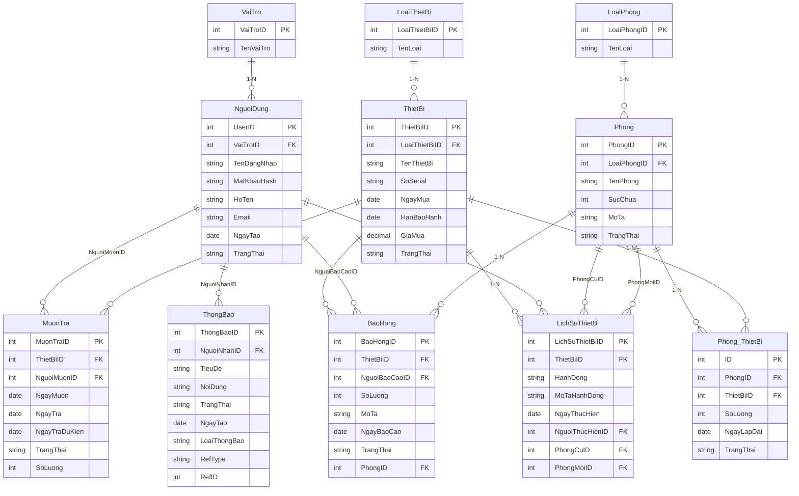

```mermaid
erDiagram
    VaiTro {
        int VaiTroID PK
        string TenVaiTro
    }
    NguoiDung {
        int UserID PK
        int VaiTroID FK
        string TenDangNhap
        string MatKhauHash
        string HoTen
        string Email
        date NgayTao
        string TrangThai
    }
    LoaiPhong {
        int LoaiPhongID PK
        string TenLoai
    }
    Phong {
        int PhongID PK
        int LoaiPhongID FK
        string TenPhong
        int SucChua
        string MoTa
        string TrangThai
    }
    LoaiThietBi {
        int LoaiThietBiID PK
        string TenLoai
    }
    ThietBi {
        int ThietBiID PK
        int LoaiThietBiID FK
        string TenThietBi
        string SoSerial
        date NgayMua
        date HanBaoHanh
        decimal GiaMua
        string TrangThai
    }
    Phong_ThietBi {
        int ID PK
        int PhongID FK
        int ThietBiID FK
        int SoLuong
        date NgayLapDat
        string TrangThai
    }
    MuonTra {
        int MuonTraID PK
        int ThietBiID FK
        int NguoiMuonID FK
        date NgayMuon
        date NgayTra
        date NgayTraDuKien
        string TrangThai
        int SoLuong
    }
    ThongBao {
        int ThongBaoID PK
        int NguoiNhanID FK
        string TieuDe
        string NoiDung
        string TrangThai
        date NgayTao
        string LoaiThongBao
        string RefType
        int RefID
    }
    BaoHong {
        int BaoHongID PK
        int ThietBiID FK
        int NguoiBaoCaoID FK
        int SoLuong
        string MoTa
        date NgayBaoCao
        string TrangThai
        int PhongID FK
    }
    LichSuThietBi {
        int LichSuThietBiID PK
        int ThietBiID FK
        string HanhDong
        string MoTaHanhDong
        date NgayThucHien
        int NguoiThucHienID FK
        int PhongCuID FK
        int PhongMoiID FK
    }

    VaiTro ||--o{ NguoiDung : "1-N"
    LoaiPhong ||--o{ Phong : "1-N"
    Phong ||--o{ Phong_ThietBi : "1-N"
    ThietBi ||--o{ Phong_ThietBi : "1-N"
    LoaiThietBi ||--o{ ThietBi : "1-N"
    NguoiDung ||--o{ MuonTra : "NguoiMuonID"
    ThietBi ||--o{ MuonTra : "1-N"
    NguoiDung ||--o{ ThongBao : "NguoiNhanID"
    ThietBi ||--o{ BaoHong : "1-N"
    NguoiDung ||--o{ BaoHong : "NguoiBaoCaoID"
    Phong ||--o{ BaoHong : "1-N"
    ThietBi ||--o{ LichSuThietBi : "1-N"
    NguoiDung ||--o{ LichSuThietBi : "NguoiThucHienID"
    Phong ||--o{ LichSuThietBi : "PhongCuID"
    Phong ||--o{ LichSuThietBi : "PhongMoiID"
```
